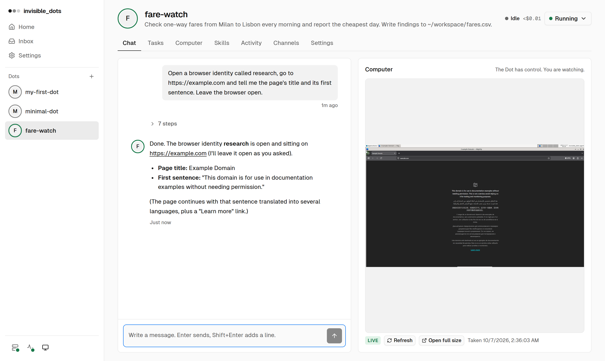

<h1 align="center">invisible_dots</h1>

<p align="center"><b>AI agents that each own a computer.</b></p>

<p align="center">
<a href="https://github.com/feder-cr/dots/actions/workflows/tests.yml"></a>
<a href="LICENSE"></a>


</p>

<p align="center">
  <picture>
    <source media="(prefers-color-scheme: dark)" srcset="docs/images/hero-dark.png">
    
  </picture>
</p>

A **Dot** is an AI agent with its own virtual machine on your PC: a desktop, a
shell, files, memory and skills that stay, and a browser that does not look
automated ([invisible_playwright_mcp](https://github.com/feder-cr/invisible_playwright_mcp)).
You decide what it may do. Any model on [OpenRouter](https://openrouter.ai).

## Quickstart

Node 24+, Go 1.25+, Git, hardware virtualization (Linux or Windows, x86-64).

```sh
git clone https://github.com/feder-cr/dots && cd dots
npm ci && npm run build --workspace @invisible-dots/cli
node apps/cli/dist/invisible-dots.mjs setup --all
node apps/cli/dist/invisible-dots.mjs server
```

Open http://127.0.0.2:3000, paste your OpenRouter key, create a Dot.

## Docs

- [Guide](docs/guide.md): install, the web UI, the command line, the browser, channels, configuration
- [Architecture](docs/architecture.md)
- [Security and privacy](docs/guide.md#security-model-and-known-limits)

Alpha: nothing is packaged yet. MIT [license](LICENSE).
