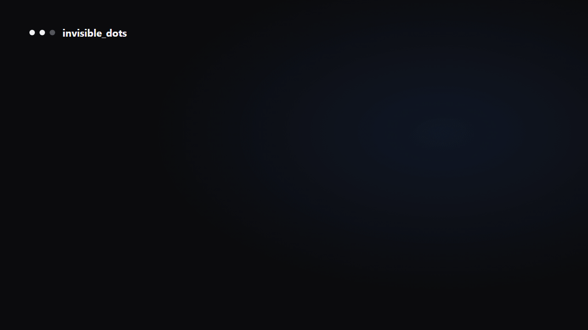

<div align="center">
<picture>
  <source media="(prefers-color-scheme: dark)" srcset="docs/images/banner-dark.png">
  
</picture>
<h3>Open-source, self-hosted alternative to OpenAI Dots, Meta Muse, Grok Bot, Manus Cue and Claude Cowork.</h3>

<a href="https://github.com/feder-cr/invisible_dots/actions/workflows/tests.yml"></a>
<a href="LICENSE"></a>


<p><a href="#quickstart"><b>Quickstart</b></a> · <a href="docs/guide.md"><b>Guide</b></a> · <a href="docs/architecture.md"><b>Architecture</b></a> · <a href="docs/guide.md#security-model-and-known-limits"><b>Security</b></a> · <a href="docs/guide.md#privacy"><b>Privacy</b></a></p>
</div>

<p align="center">
  
</p>

A **Dot** is a persistent AI agent with a QEMU virtual machine of its own, on your own PC. Its disk, files, memory,
skills and browser logins outlast every task. You talk to it from a web UI, the command line, an HTTP API or
Telegram, and it runs on any model on [OpenRouter](https://openrouter.ai), with your key.

## Quickstart

You need Node 24+, Go 1.25+, Git and hardware virtualization (x86-64), plus an OpenRouter key.

**Windows** (PowerShell):

```powershell
winget install -e --id OpenJS.NodeJS.LTS; winget install -e --id GoLang.Go; winget install -e --id Git.Git
git clone https://github.com/feder-cr/invisible_dots; cd invisible_dots
npm ci; npm run build --workspace @invisible-dots/cli
node apps/cli/dist/invisible-dots.mjs setup --all
node apps/cli/dist/invisible-dots.mjs server
```

**Linux** (Ubuntu 24.04):

```bash
curl -fsSL https://deb.nodesource.com/setup_24.x | sudo -E bash - && sudo apt-get install -y nodejs git && sudo snap install go --classic
git clone https://github.com/feder-cr/invisible_dots && cd invisible_dots
npm ci && npm run build --workspace @invisible-dots/cli
node apps/cli/dist/invisible-dots.mjs setup --all
node apps/cli/dist/invisible-dots.mjs server
```

`setup --all` installs QEMU and turns on the accelerator (KVM, or the Windows Hypervisor Platform), then builds or
downloads the Dot's images; run it again after a restart and it carries on. Then open **http://127.0.0.2:3000**,
paste your OpenRouter key and create your first Dot. Every step and its failure modes:
[the guide's quickstart](docs/guide.md#quickstart).

## What to ask a Dot

Anything that needs a computer and a person's judgement, for as long as it takes:

> Open a browser identity called research, go to https://example.com and tell me the page's title and its first
> sentence. Leave the browser open.

> Every morning, check one-way fares from Milan to Lisbon for the next two weeks, write them to
> ~/workspace/fares.csv and tell me the cheapest day.

> Log in to the shop with the shopping identity, download this month's invoices to ~/documents, and remember where
> the invoices page is for next time.

## What a Dot has

| | |
|---|---|
| **[A computer of its own](docs/guide.md#what-a-dot-can-do)** | A hardware-accelerated VM with a Linux desktop and a persistent disk. It sleeps when idle and wakes for the next message, task or automation. |
| **[A browser that is not blocked](docs/guide.md#the-browser)** | [invisible_playwright_mcp](https://github.com/feder-cr/invisible_playwright_mcp): Firefox patched in C++, the fingerprint set inside the engine. Each identity keeps its own cookies and logins. |
| **[Memory and skills](docs/guide.md#what-a-dot-can-do)** | It writes its own notes and how-tos in its home folder, as Claude Code does, and reads them on the next task. |
| **[Permissions you set](docs/guide.md#approvals)** | Every tool belongs to a permission: allow, ask or deny. An ask waits in your Inbox, survives a restart and runs the call once. |
| **[Tasks and automations](docs/guide.md#the-web-ui)** | A queue with priorities and start times, and its own recurring jobs, for which its computer is started on time. |
| **[Many ways to reach it](docs/guide.md#talk-to-it-from-your-phone)** | Web UI, command line, HTTP API with live events, Telegram, and WhatsApp as an opt-in. |
| **[Nothing lost on a crash](docs/guide.md#how-it-works)** | A restart or a `kill -9` keeps every message and task you saw accepted, and a tool call cut short is never run twice. |

## Which one fits

| | A browser API or library | A cloud sandbox for agents | invisible_dots |
|---|---|---|---|
| Where the agent's work runs | Your code drives a browser | A machine in someone's cloud | A VM on your own PC, one per agent |
| What stays between tasks | What your code saves | What the sandbox keeps, for its lifetime | Its disk, files, memory, skills and browser logins |
| The browser | Chromium, often over CDP | Whatever the sandbox ships | Firefox patched in C++, one identity per profile |
| Risky actions | Your code decides | Your code decides | Allow, ask or deny per permission, answered from the Inbox or a chat |
| What you write | Code | Code | A message or a task |

## Documentation

- [Guide](docs/guide.md): install, the web UI, the command line, the browser, channels, configuration, updating
- [Architecture](docs/architecture.md): every component and why it is there
- [Troubleshooting](docs/guide.md#troubleshooting) and [development and tests](docs/guide.md#development-and-tests)

## Related projects

**The pieces of this one.** A Dot's browser is
[invisible_playwright_mcp](https://github.com/feder-cr/invisible_playwright_mcp), on
[invisible_playwright](https://github.com/feder-cr/invisible_playwright) and
[invisible_core](https://github.com/feder-cr/invisible_core); the engine is a fork of
[nanobot](https://github.com/HKUDS/nanobot).

**Neighbours.** [cua](https://github.com/trycua/cua) gives agents computers through its own SDK and sandboxes;
[E2B](https://github.com/e2b-dev/E2B) runs agents' code in cloud sandboxes; [OpenHands](https://github.com/All-Hands-AI/OpenHands)
is a platform for software-development agents; [browser-use](https://github.com/browser-use/browser-use) lets an LLM
drive a Chromium browser from Python; [Open Interpreter](https://github.com/OpenInterpreter/open-interpreter) runs
the code a model writes on your own machine. invisible_dots puts the agent, its computer and its browser on your PC,
one VM per agent, behind permissions you set.

## License

MIT, see [LICENSE](LICENSE). Third-party components and their licenses: [THIRD_PARTY_NOTICES.md](THIRD_PARTY_NOTICES.md).

## Disclaimer

This project is provided as-is, with no warranties. Use it at your own risk and in compliance with the laws of your
jurisdiction. A Dot acts with your accounts and from your connection: respect the terms of the sites it visits and
their robots.txt.

---

<p align="center">
  Built by <a href="https://it.linkedin.com/in/federico-elia-5199951b6">Federico Elia</a>
</p>
